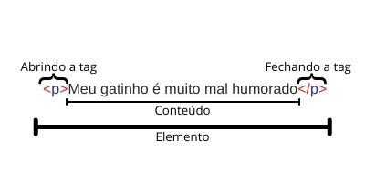
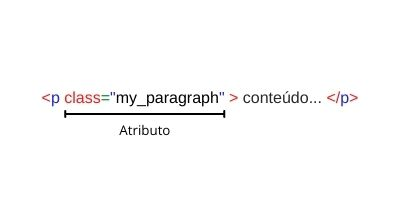

# HTML

***O que estas quatro letrinhas significam? O que é HTML? Para que serve? É linguagem de programação?****

Ok, são perguntas sábias, então vou responder agora.

HTML é um acrônimo para HyperText Markup Language, ou em bom Português, Linguagem de Marcação de Hipertexto, e ela é uma linguagem de marcação como o próprio nome já diz, não de programação. 

Ele é o bloco de construção mais básico da web. Define a semântica/significado e a estrutura do conteúdo da web.

Outras tecnologias além do HTML geralmente são usadas para construção de uma webpage, tendo o ```CSS``` a responsabilidade de tomar conta da aparência/apresentação, e o ```JavaScript``` tendo como responsabilidade dar funcionalidade/alterar o comportamento.

***Ok, mas o que é exatamente hipertexto?***

"Hipertexto" refere-se aos links que conectam páginas da Web entre si, seja dentro de um único site ou entre sites. Links são um aspecto fundamental da web. Ao carregar conteúdo na Internet e vinculá-lo a páginas criadas por outras pessoas, você se torna um participante ativo na world wide web **(WWW)**.

***Entendido. Mas como funciona este tal?***

O HTML usa "marcação", isso quer dizer que para anotar texto, imagem dentre outros você vai usar tags para exibir corretamente no browser. A maração do HTML inclui alguns elementos especiais como ```<html>``` que marca o início/fim do nosso documento HTML, ```<head>```, ```<body>```, ```<title>```, dentre outros.

Um elemento HTML é separado de outro texto em um documento por "tags", que consistem no nome do elemento entre "<" e ">". O nome de um elemento dentro de uma tag é insensível a maiúsculas e minúsculas. Isto é, pode ser escrito em maiúsculas, minúsculas ou uma mistura. Por exemplo, a tag ```<title>``` pode ser escrita como ```<Title>```, ```<TITLE>``` ou de qualquer outra forma, mas por convensão escrevemos os nomes de tags em minúsculo.

### Anatomia de um elemento HTML

Ok. Agora vamos ver como funciona as tags/elementos do nosso HTML.

Suponhamos que você quisesse escrever uma frase em um documento HTML, e essa frase fosse algo como "```Meu gatinho é muito mal humorado```", se quiséssemos que a linha permanecesse por si só, isto é, se quiséssemos que a frase ficasse sozinha em uma linha, poderíamos especificar que é um parágrafo colocando-a em uma tag de parágrafo:

> ```<p>Meu gatinho é muito mal humorado</p>```

Então agora teríamos esta anatomia:



As principais partes de um elemento são:

1. A tag de abertura: Consiste no nome do elemento (no caso, p), envolvido em parênteses angulares de abertura e fechamento. Isso demonstra onde o elemento começa, ou onde seu efeito se inicia — nesse caso, onde é o começo do parágrafo.
2. A tag de fechamento: Isso é a mesma coisa que a tag de abertura, exceto que inclui uma barra antes do nome do elemento. Isso demonstra onde o elemento acaba — nesse caso, onde é o fim do parágrafo. Esquecer de incluir uma tag de fechamento é um dos erros mais comuns de iniciantes e pode levar a resultados estranhos, por vezes o elemento nem renderiza.
3. O conteúdo: Esse é o conteúdo do elemento, que nesse caso é apenas a nossa frase.
4. O elemento: A tag de abertura, a de fechamento, e o conteúdo formam o elemento.

Elementos também podem ter atributos que identificam melhor o elemento, definem aparência ou o que mais precisar, ficando como na imagem abaixo:



Atributos contém informação extra sobre o elemento que você não quer que apareça no conteúdo real. Aqui, ```class``` é o nome do atributo e ```editor-note``` é o valor do atributo. O atributo ```class``` permite que você forneça ao elemento um identificador que possa ser usado posteriormente para aplicar ao elemento informações de estilo e/ou funcionalidades.

Um atributo sempre deve ter:

1. Um espaço entre ele e o nome do elemento (ou o atributo anterior, se o elemento já tiver um).
2. O nome do atributo, seguido por um sinal de igual.
3. Aspas de abertura e fechamento, envolvendo todo o valor do atributo.

> O valor do atributo também pode ser envolvido por aspas simples, mas por convensão usamos aspas duplas.

> **Nota:** Atributos sem valores podem ser definidos sem usar o simbolo de igualdade e aspas, ex: ```disabled=""```, pode ser definido assim ```disabled```


### Aninhando elementos

Ok, você deve ta me perguntando como aninhar os elementos e fazer um documento mais complexo, pois bem, agora veremos isto.

Você pode colocar elementos dentro de outros elementos também — isso é chamado de aninhamento. Se quiséssemos afirmar que nosso gato é **muito** mal-humorado, poderíamos envolver a palavra "muito" em um elemento ```<strong>```, o que significa que a palavra deve ser fortemente enfatizada, ou seja, deixa a em negrito. Então faríamos assim:

> ```<p>Meu gatinho é <strong>muito</strong> mal humorado.</p>```

Você precisa, no entanto, certificar-se de que seus elementos estejam adequadamente aninhados. No exemplo acima, abrimos primeiro o elemento ```<p>```, depois o elemento ```<strong>```; portanto, temos que fechar primeiro o elemento ```<strong>```, depois o elemento ```<p>```. Se fizermos como abaixo, estaremos cometendo um erro, e nosso HTML pode não ser renderizado:

> ```<p>Meu gatinho é <strong>muito mal humorado.</p></strong>```

### Elemento vazos

Alguns elementos não possuem conteúdo e são chamados de elementos vazios, exemplo o elemento `````` que temos na nossa página HTML:

> ``````

Como pode ser visto, ele possui dois atributos, mas não há tag ```</img>``` de fechamento, e não há conteúdo interno. Isso acontece porque um elemento de imagem não envolve conteúdo para ter efeito em si mesmo. Sua proposta é incorporar uma imagem na página HTML no lugar que o código aparece.

### Anatomia de um documento HTML

Isso resume o básico dos elementos HTML individuais, mas eles na maioria das vezes não são úteis por si só. Agora vamos ver como elementos individuais são combinados para formar uma página HTML inteira. Vamos ver um exemplo de documento ```html``` que o chamaremos de ```index.html```.

```html
<!DOCTYPE html>
<html>
  <head>
    <meta charset="utf-8">
    <title>Minha página de teste</title>
  </head>
  <body>
    
  </body>
</html>
```

Aqui nós temos:

- ```<!DOCTYPE html>``` — o doctype. É a parte inicial obrigatória do documento. Nas névoas do tempo, quando o HTML era novo (por volta de 1991/2), doctypes eram criados para agir como links para um conjunto de regras que a página HTML tinha que seguir para ser considerada um bom HTML, o que poderia significar checagem automática de erros e outras coisas úteis. No entanto, atualmente, eles não fazem muito sentido e são basicamente necessários apenas para garantir que o documento se comporte corretamente. Isso é tudo que você precisa saber agora.
- ```<html></html>``` — o elemento ```<html>``` envolve todo o conteúdo da página e às vezes é conhecido como o elemento raiz.
- ```<head></head>``` — o elemento ```<head>``` age como um recipiente de tudo o que você deseja incluir em uma página HTML que não é o conteúdo que você quer mostrar para quem vê sua página. Isso inclui coisas como palavras-chave e uma descrição que você quer que apareça nos resultados de busca, ```CSS``` para dar estilo ao conteúdo, declarações de conjuntos de caracteres e etc.
- ```<meta charset="utf-8">``` — esse elemento define o conjunto de caracteres que seu documento deve usar, no nosso exemplo e na maioria dos casos, ```UTF-8```, que inclui praticamente todos os caracteres da grande maioria dos idiomas escritos. Essencialmente, agora ele pode manipular qualquer conteúdo textual que você possa colocar. Não há razão para não definir isso e assim pode ajudar a evitar alguns problemas no futuro.
- ```<title></title>``` — o elemento ```<title>``` define o título da sua página, que é o título que aparece na guia do navegador onde sua página é carregada. Ele também é usado para descrever a página quando você a adiciona aos favoritos.
- ```<body></body>``` — o elemento ```<body>``` contém todo o conteúdo que você quer mostrar ao público que visita sua página, seja texto, imagens, vídeos, jogos, faixas de áudio reproduzíveis ou qualquer outra coisa.

> **Nota:** Tudo que você for colocar para exibir agora ou futuramente, provavelmente vais colocar no ```<body>```
